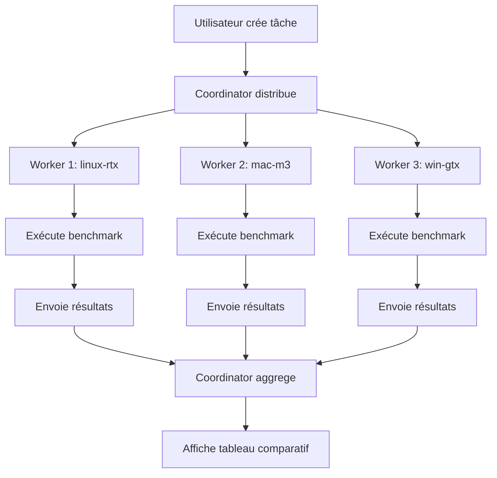

# 🚀 Roadmap d'Innovation - LLM Benchmarker

**Version** : 0.05  
**Dernière mise à jour** : 2025-05-22  
**Statut** : Planification en cours

---

## 📋 Table des matières

- [Introduction](#introduction)
- [Niveau 1 : Multi-GPU sur une machine ✅ IMPLEMENTÉ](#niveau-1--multi-gpu-sur-une-machine--implementé)
- [Niveau 2 : Multi-machine avec Agrégation 📋 PLANIFIÉ](#niveau-2--multi-machine-avec-agrégation--planifié)
- [Niveau 3 : Cluster avec Coordination 🎯 FUTUR](#niveau-3--cluster-avec-coordination--futur)
- [Format de résultats standardisé](#format-de-résultats-standardisé)
- [Contribuer](#contribuer)

---

## 🎯 Introduction

Ce document décrit les **améliorations futures** du LLM Benchmarker pour supporter :
1. **Les configurations multi-GPU** sur une seule machine
2. **Les environnements multi-machines** (clusters)
3. **Les architectures distribuées** pour le benchmark à grande échelle

> **Note** : Ce document est référencé dans le [README.md](README.md) pour les contributeurs.

---

## ✅ Niveau 1 : Multi-GPU sur une machine

**Statut** : ✅ **IMPLEMENTÉ** dans cette branche  
**Priorité** : ⭐⭐⭐⭐⭐ (Haute)  
**Complexité** : ⭐⭐  
**Temps estimé** : Déjà implémenté

### 🎯 Objectif
Permettre aux utilisateurs de **sélectionner quel GPU utiliser** pour les benchmarks sur les machines équipées de plusieurs cartes graphiques (ex: laptop avec iGPU Intel + dGPU NVIDIA).

### 🔧 Implémentation

#### Backend (server.js)
- ✅ Détection de **tous les GPUs** disponibles (NVIDIA, AMD, Intel)
- ✅ Priorisation intelligente : NVIDIA > AMD > Intel
- ✅ Récupération de la VRAM pour chaque GPU
- ✅ Classification par type (`dedicated`/`integrated`)
- ✅ Retour de la liste complète via `/api/environment`

#### Frontend
- ✅ Affichage de tous les GPUs détectés
- ✅ Sélection automatique du GPU dédié principal
- ✅ Indicateur visuel du GPU actif

#### Sélection manuelle du GPU
**Nouvelle fonctionnalité** : Permettre à l'utilisateur de forcer l'utilisation d'un GPU spécifique.

**Méthode** :
- Ajout d'un sélecteur de GPU dans l'UI
- Stockage de la sélection dans `localStorage`
- Transmission du GPU sélectionné au backend
- Utilisation de `CUDA_VISIBLE_DEVICES` pour Ollama

**Exemple d'utilisation** :
```javascript
// Si l'utilisateur sélectionne le GPU index 1 (NVIDIA)
// Le backend devrait démarrer Ollama avec :
CUDA_VISIBLE_DEVICES=1 ollama serve
```

### 📊 Cas d'usage
| Scénario | Comportement |
|----------|--------------|
| Machine avec 1 GPU | Sélection automatique, pas de changement |
| Machine avec Intel iGPU + NVIDIA dGPU | NVIDIA sélectionné par défaut |
| Machine avec 2× NVIDIA RTX 3070 | Premier GPU sélectionné, possibilité de changer |
| Machine avec AMD + NVIDIA | NVIDIA sélectionné par défaut |

### ✅ Validation
- [x] Détection multi-GPU fonctionnelle
- [x] Priorisation NVIDIA > AMD > Intel
- [x] Affichage dans l'UI
- [ ] Sélecteur de GPU dans l'UI *(à implémenter)*
- [ ] Persistance de la sélection *(à implémenter)*

---

## 📋 Niveau 2 : Multi-machine avec Agrégation

**Statut** : 📋 **PLANIFIÉ**  
**Priorité** : ⭐⭐⭐ (Moyenne)  
**Complexité** : ⭐⭐⭐  
**Temps estimé** : 2-3 jours

### 🎯 Objectif
Permettre de **comparer les performances entre différentes machines** sans architecture distribuée complexe.

### 🏗️ Architecture proposée

```
┌─────────────────────────────────────────────────────────────┐
│                        NAVIGATEUR                              │
│                                                               │
│  ┌───────────────────────────────────────────────────────┐ │
│  │                 Result Aggregator                      │ │
│  │  ┌─────────────┐  ┌─────────────┐  ┌─────────────┐  │ │
│  │  │  Machine A  │  │  Machine B  │  │  Machine C  │  │ │
│  │  │  (Import)    │  │  (Import)    │  │  (Import)    │  │ │
│  │  └─────────────┘  └─────────────┘  └─────────────┘  │ │
│  │                                                      │ │
│  │  ┌───────────────────────────────────────────────┐ │ │
│  │  │           Tableau Comparatif                    │ │ │
│  │  │  ┌─────────┬─────────┬─────────┐              │ │ │
│  │  │  │ Machine │ Modèle  │ Tokens/s │              │ │ │
│  │  │  ├─────────┼─────────┼─────────┤              │ │ │
│  │  │  │ Mac M3  │ Llama3  │   45.2   │              │ │ │
│  │  │  │ RTX 4090│ Llama3  │   89.5   │              │ │ │
│  │  │  └─────────┴─────────┴─────────┘              │ │ │
│  │  └───────────────────────────────────────────────┘ │ │
│  └───────────────────────────────────────────────────────┘ │
└─────────────────────────────────────────────────────────────┘
```

### 🔧 Implémentation requise

#### 1. Format d'export standardisé
Créer un format JSON normalisé pour les résultats :

```json
{
  "version": "0.05",
  "metadata": {
    "timestamp": "2025-05-22T12:00:00Z",
    "appVersion": "0.05"
  },
  "machine": {
    "id": "mac-m3-001",
    "name": "MacBook Pro M3",
    "os": {
      "name": "macOS",
      "version": "14.5",
      "arch": "arm64"
    },
    "cpu": {
      "model": "Apple M3 Pro",
      "cores": 12,
      "clockSpeed": "2400 MHz"
    },
    "gpu": {
      "model": "Apple M3 Pro",
      "type": "integrated",
      "vram": "Unifiée",
      "driver": "Apple Silicon"
    },
    "ram": {
      "totalGB": 36,
      "freeGB": 10
    }
  },
  "runner": {
    "type": "ollama",
    "baseUrl": "http://localhost:11434",
    "version": "0.3.0"
  },
  "test": {
    "model": "llama3.2:70b",
    "promptType": "code",
    "prompt": "Écris une fonction Python pour...",
    "temperature": 0.2,
    "maxTokens": 4096,
    "repetitions": 1
  },
  "results": {
    "tokensGenerated": 1542,
    "tokensPerSecond": 45.2,
    "ttftMs": 234,
    "totalTimeMs": 8500,
    "temperatureUsed": 0.2,
    "memory": {
      "peakMB": 2456,
      "averageMB": 1892
    }
  },
  "environment": {
    "backendEnabled": true,
    "backendPort": 3001
  }
}
```

#### 2. Import/Export dans l'UI
- Bouton **"Importer des résultats"** pour ajouter des fichiers JSON
- Bouton **"Exporter tout"** pour télécharger tous les résultats
- **Fusion automatique** des résultats importés dans le tableau comparatif

#### 3. Tableau comparatif
- Affichage **side-by-side** des résultats par machine
- Tri et filtrage par :
  - Machine (OS, GPU, CPU)
  - Modèle testé
  - Type de prompt
  - Date du test
- **Graphiques** simples (barres pour Tokens/s, TTFT, etc.)

#### 4. Tagging des machines
- Attribution d'un **ID unique** par machine (UUID ou nom personnalisé)
- Persistance dans `localStorage` :
  ```json
  {
    "machines": {
      "mac-m3-001": {
        "name": "MacBook Pro M3",
        "os": "macOS",
        "gpu": "Apple M3 Pro",
        "lastSeen": "2025-05-22T12:00:00Z"
      },
      "linux-rtx-001": {
        "name": "Serveur RTX 4090",
        "os": "Ubuntu",
        "gpu": "NVIDIA RTX 4090",
        "lastSeen": "2025-05-22T11:00:00Z"
      }
    }
  }
  ```

### 📊 Exemple d'utilisation

1. **Sur Machine A (Mac M3)** :
   ```bash
   cd llm-benchmarker
   python3 -m http.server 8000
   # Lance benchmark → Exporte results_mac.json
   ```

2. **Sur Machine B (Linux RTX 4090)** :
   ```bash
   cd llm-benchmarker
   python3 -m http.server 8000
   # Lance benchmark → Exporte results_linux.json
   ```

3. **Sur une 3ème machine (comparaison)** :
   - Ouvre l'UI
   - Importe `results_mac.json` et `results_linux.json`
   - Voit le **tableau comparatif** automatique

### ✅ Avantages
- ✅ **Aucun changement architecture backend**
- ✅ **Compatible avec l'existant**
- ✅ **Flexible** (machines hétérogènes)
- ✅ **Pas de dépendance réseau** entre machines
- ✅ **Simple à implémenter**

### ⚠️ Limitations
- ❌ **Pas de contrôle centralisé**
- ❌ **Import manuel** des résultats
- ❌ **Pas de synchronisation** entre machines

---

## 🎯 Niveau 3 : Cluster avec Coordination

**Statut** : 🎯 **FUTUR**  
**Priorité** : ⭐⭐ (Basse - Complexe)  
**Complexité** : ⭐⭐⭐⭐⭐  
**Temps estimé** : 2-3 semaines

### 🎯 Objectif
Créer une **architecture distribuée** avec :
- Un **coordinator** central
- Plusieurs **workers** (un par machine)
- **Orchestration automatique** des benchmarks

### 🏗️ Architecture distribuée

```
                    ┌─────────────────┐
                    │   COORDINATOR   │  (Machine principale)
                    │  (Node.js/REST)  │
                    └─────────┬───────┘
                              │
        ┌─────────────────────┼─────────────────────┐
        │                     │                     │
        ▼                     ▼                     ▼
┌───────────────┐    ┌───────────────┐    ┌───────────────┐
│    WORKER     │    │    WORKER     │    │    WORKER     │
│  (Linux RTX)  │    │  (Mac M3)     │    │ (Win RTX)     │
│               │    │               │    │               │
│  ┌─────────┐  │    │  ┌─────────┐  │    │  ┌─────────┐  │
│  │ Ollama  │  │    │  │ Ollama  │  │    │  │ Ollama  │  │
│  └─────────┘  │    │  └─────────┘  │    │  └─────────┘  │
│  ┌─────────┐  │    │  ┌─────────┐  │    │  ┌─────────┐  │
│  │ Backend │◄─┼─────┤ Backend │◄─┼─────┤ Backend │◄─┘
│  └─────────┘  │    │  └─────────┘  │    │  └─────────┘  │
└───────────────┘    └───────────────┘    └───────────────┘
        ▲                     ▲                     ▲
        │                     │                     │
        └─────────────────────┴─────────────────────┘
                              │
                    (HTTP/REST ou WebSocket)
```

### 🔧 Composants

#### 1. Coordinator (Nouveau service)
**Rôle** : Orchestrer les benchmarks sur le cluster.

**Fonctionnalités** :
- Découverte des workers (auto ou manuelle)
- Distribution des tâches
- Agrégation des résultats
- Interface de gestion
- Historique centralisé

**Endpoints API** :
```
POST   /api/tasks          # Créer une nouvelle tâche
GET    /api/tasks          # Lister les tâches
GET    /api/tasks/{id}     # Statut d'une tâche
POST   /api/workers/register # Enregistrement d'un worker
GET    /api/workers        # Lister les workers disponibles
GET    /api/results         # Récupérer tous les résultats
DELETE /api/tasks/{id}     # Annuler une tâche
```

**Exemple de tâche** :
```json
{
  "taskId": "abc123-def456",
  "createdAt": "2025-05-22T12:00:00Z",
  "status": "pending",
  "model": "llama3.2:70b",
  "promptTypes": ["code", "math", "conversation"],
  "config": {
    "temperature": 0.7,
    "maxTokens": 4096,
    "repetitions": 1
  },
  "targets": ["linux-rtx-001", "mac-m3-001"],
  "results": {}
}
```

#### 2. Workers (Backend existant + client)
**Rôle** : Exécuter les benchmarks localement.

**Modifications nécessaires** :
- Ajout d'un **client REST** pour communiquer avec le coordinator
- **Enregistrement automatique** auprès du coordinator
- **Polling** des tâches à exécuter
- **Envoi des résultats** au coordinator

**Nouveaux endpoints worker** :
```
GET  /api/worker/info    # Infos machine (OS, GPU, CPU, RAM)
POST /api/worker/tasks   # Récupère les tâches assignées
POST /api/worker/results  # Envoie les résultats
```

#### 3. Service de découverte (Optionnel)
**Méthodes possibles** :

| Méthode | Description | Complexité |
|---------|-------------|------------|
| **Config manuelle** | Fichier JSON avec liste des workers | ⭐ |
| **mDNS/Bonjour** | Découverte automatique sur le réseau local | ⭐⭐⭐ |
| **Broadcast UDP** | Diffusion sur le sous-réseau | ⭐⭐ |
| **Service externe** | Base de données partagée (Redis, etc.) | ⭐⭐⭐⭐ |

**Recommandation** : Commencer par la **config manuelle**, puis ajouter mDNS.

#### 4. Frontend (UI Cluster)
**Nouveautés** :
- **Page "Cluster"** dédiée
- **Liste des workers** connectés avec leur status
- **Création de tâches** distribuées
- **Tableau de bord** temps réel
- **Visualisation comparatif** entre machines

**Exemple UI** :
```
┌─────────────────────────────────────────────────────────────┐
│  🏗️ GESTION DU CLUSTER                                         │
├─────────────────────────────────────────────────────────────┤
│                                                               │
│  WORKERS CONNECTÉS (3)                                         │
│  ┌─────────────┐ ┌─────────────┐ ┌─────────────┐              │
│  │ ✅ linux-rtx│ │ ✅ mac-m3   │ │ ❌ win-gtx  │              │
│  │ RTX 4090   │ │ Apple M3   │ │ RTX 3070   │              │
│  │ 16/32 Go    │ │ 16/36 Go    │ │ Hors ligne │              │
│  └─────────────┘ └─────────────┘ └─────────────┘              │
│                                                               │
│  NOUVELLE TÂCHE :                                             │
│  Modèle: [llama3.2:70b      ▼]                                │
│  Types:  ☑ Code ☑ Math ☑ Conversation ☐ Créatif              │
│  Workers: ☑ linux-rtx ☑ mac-m3 ☐ win-gtx                    │
│                                                               │
│  [🚀 Lancer la tâche distribuée]                              │
│                                                               │
│  TÂCHES EN COURS (1)                                          │
│  ┌───────────────────────────────────────────────────────┐ │
│  │ Tâche #abc123 · llama3.2:70b · 3/3 workers · 67%      │ │
│  │ ████████████░░░░░░░░░░░░                                   │ │
│  └───────────────────────────────────────────────────────┘ │
└─────────────────────────────────────────────────────────────┘
```

### 📊 Workflow complet



### 🔧 Dépendances techniques

| Composant | Technologie | Version |
|-----------|-------------|---------|
| Coordinator | Node.js + Express | v18+ |
| Workers | Backend existant + Axios | v18+ |
| Communication | HTTP/REST ou WebSocket | - |
| Découverte | mDNS (optionnel) | - |
| Storage | JSON files ou SQLite | - |

### ✅ Avantages
- ✅ **Contrôle centralisé** des benchmarks
- ✅ **Orchestration automatique**
- ✅ **Scalable** (ajout facile de nouveaux workers)
- ✅ **Comparaison en temps réel**
- ✅ **Historique centralisé**

### ⚠️ Limitations/Défis
- ❌ **Complexité accrue** (nouvelle architecture)
- ❌ **Dépendances réseau** entre machines
- ❌ **Sécurité** à implémenter (authentification)
- ❌ **Gestion des échecs** (workers down)
- ❌ **Latence réseau** peut affecter les mesures

---

## 📄 Format de résultats standardisé

**Spécification pour l'interopérabilité entre versions et machines**

### Schéma JSON complet

```json
{
  "$schema": "http://json-schema.org/draft-07/schema#",
  "type": "object",
  "properties": {
    "version": {
      "type": "string",
      "description": "Version du schema de résultats"
    },
    "metadata": {
      "type": "object",
      "properties": {
        "timestamp": {
          "type": "string",
          "format": "date-time",
          "description": "Date/heure du test"
        },
        "appVersion": {
          "type": "string",
          "description": "Version de l'application"
        },
        "sessionId": {
          "type": "string",
          "description": "ID unique de la session"
        }
      },
      "required": ["timestamp", "appVersion"]
    },
    "machine": {
      "type": "object",
      "properties": {
        "id": {
          "type": "string",
          "description": "ID unique de la machine"
        },
        "name": {
          "type": "string",
          "description": "Nom personnalisé de la machine"
        },
        "os": {
          "type": "object",
          "properties": {
            "name": {"type": "string"},
            "version": {"type": "string"},
            "arch": {"type": "string"}
          },
          "required": ["name", "arch"]
        },
        "cpu": {
          "type": "object",
          "properties": {
            "model": {"type": "string"},
            "cores": {"type": "integer"},
            "clockSpeed": {"type": "string"}
          }
        },
        "gpu": {
          "type": "object",
          "properties": {
            "model": {"type": "string"},
            "type": {"enum": ["dedicated", "integrated"]},
            "vramMB": {"type": ["integer", "null"]},
            "driver": {"type": "string"}
          }
        },
        "ram": {
          "type": "object",
          "properties": {
            "totalMB": {"type": "integer"},
            "freeMB": {"type": "integer"}
          }
        }
      },
      "required": ["id", "os", "cpu"]
    },
    "runner": {
      "type": "object",
      "properties": {
        "type": {"type": "string"},
        "baseUrl": {"type": "string"},
        "version": {"type": "string"}
      },
      "required": ["type", "baseUrl"]
    },
    "test": {
      "type": "object",
      "properties": {
        "model": {"type": "string"},
        "promptType": {"type": "string"},
        "prompt": {"type": ["string", "null"]},
        "temperature": {"type": "number"},
        "maxTokens": {"type": "integer"},
        "repetitions": {"type": "integer"}
      },
      "required": ["model", "promptType", "temperature", "maxTokens"]
    },
    "results": {
      "type": "object",
      "properties": {
        "tokensGenerated": {"type": "integer"},
        "tokensPerSecond": {"type": "number"},
        "ttftMs": {"type": ["integer", "null"]},
        "totalTimeMs": {"type": "integer"},
        "temperatureUsed": {"type": "number"},
        "memory": {
          "type": "object",
          "properties": {
            "peakMB": {"type": ["integer", "null"]},
            "averageMB": {"type": ["integer", "null"]}
          }
        }
      },
      "required": ["tokensGenerated", "tokensPerSecond", "totalTimeMs"]
    },
    "environment": {
      "type": "object",
      "properties": {
        "backendEnabled": {"type": "boolean"},
        "backendPort": {"type": ["integer", "null"]}
      }
    }
  },
  "required": ["version", "metadata", "machine", "runner", "test", "results"]
}
```

### Exemple concret

```json
{
  "version": "1.0",
  "metadata": {
    "timestamp": "2025-05-22T12:34:56.789Z",
    "appVersion": "0.05",
    "sessionId": "a1b2c3d4-e5f6-7890"
  },
  "machine": {
    "id": "linux-rtx-001",
    "name": "Serveur Deep Learning",
    "os": {
      "name": "Ubuntu",
      "version": "24.04",
      "arch": "x64"
    },
    "cpu": {
      "model": "AMD Ryzen 9 7950X",
      "cores": 16,
      "clockSpeed": "4500 MHz"
    },
    "gpu": {
      "model": "NVIDIA GeForce RTX 4090",
      "type": "dedicated",
      "vramMB": 24576,
      "driver": "550.54.15"
    },
    "ram": {
      "totalMB": 65536,
      "freeMB": 32768
    }
  },
  "runner": {
    "type": "ollama",
    "baseUrl": "http://localhost:11434",
    "version": "0.3.0"
  },
  "test": {
    "model": "llama3.2:70b",
    "promptType": "code",
    "prompt": "Écris une fonction Python pour calculer la factorielle...",
    "temperature": 0.2,
    "maxTokens": 4096,
    "repetitions": 1
  },
  "results": {
    "tokensGenerated": 1542,
    "tokensPerSecond": 45.23,
    "ttftMs": 234,
    "totalTimeMs": 8500,
    "temperatureUsed": 0.2,
    "memory": {
      "peakMB": 12456,
      "averageMB": 8934
    }
  },
  "environment": {
    "backendEnabled": true,
    "backendPort": 3001
  }
}
```

---

## 🤝 Contribuer

Les contributions sont les bienvenues ! Voici comment participer :

### Pour le Niveau 1 (Multi-GPU)
- **Statut** : En cours d'implémentation
- **Branche** : `feat/multi-gpu-support`
- **Tâches** :
  - [x] Détection multi-GPU
  - [x] Priorisation intelligente
  - [ ] Sélecteur de GPU dans l'UI
  - [ ] Persistance de la sélection
  - [ ] Intégration avec Ollama (CUDA_VISIBLE_DEVICES)

### Pour le Niveau 2 (Multi-machine)
- **Statut** : Planifié
- **Branche** : À créer (`feat/multi-machine`)
- **Tâches** :
  - [ ] Implémenter le format JSON standard
  - [ ] Ajouter l'import/export dans l'UI
  - [ ] Créer le tableau comparatif
  - [ ] Implémenter le tagging des machines
  - [ ] Tests d'interopérabilité

### Pour le Niveau 3 (Cluster)
- **Statut** : Futur
- **Branche** : À créer (`feat/cluster-support`)
- **Tâches** :
  - [ ] Créer le service Coordinator
  - [ ] Modifier le backend pour devenir un worker
  - [ ] Implémenter le protocole de communication
  - [ ] Ajouter la page Cluster dans l'UI
  - [ ] Implémenter la découverte des workers
  - [ ] Gestion des erreurs et reconnexion
  - [ ] Documentation complète

### Comment démarrer
1. **Forker** le dépôt
2. **Créer une branche** dédiée (`git checkout -b feat/[nom]`)
3. **Discuter** l'implémentation (Pull Request ou Issues)
4. **Implémenter** par petites étapes
5. **Tester** sur différents environnements
6. **Documenter** les changements

---

## 📚 Ressources

- [README.md](README.md) - Documentation principale
- [BACKEND_README.md](BACKEND_README.md) - Documentation du backend
- [Architecture actuelle](#architecture) - Comprendre le code existant

---

**© 2025 [NVNC](https://nvnc.fr)** - Développé pour la communauté LLM
